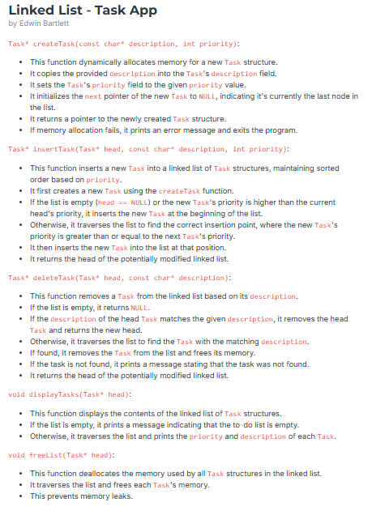

# Linked List - Task App  
**by Edwin Bartlett**  

  

Task* createTask(const char* description, int priority):

This function dynamically allocates memory for a new Task structure.
It copies the provided description into the Task's description field.
It sets the Task's priority field to the given priority value.
It initializes the next pointer of the new Task to NULL, indicating it's currently the last node in the list.
It returns a pointer to the newly created Task structure.
If memory allocation fails, it prints an error message and exits the program.
Task* insertTask(Task* head, const char* description, int priority):

This function inserts a new Task into a linked list of Task structures, maintaining sorted order based on priority.
It first creates a new Task using the createTask function.
If the list is empty (head == NULL) or the new Task's priority is higher than the current head's priority, it inserts the new Task at the beginning of the list.
Otherwise, it traverses the list to find the correct insertion point, where the new Task's priority is greater than or equal to the next Task's priority.
It then inserts the new Task into the list at that position.
It returns the head of the potentially modified linked list.
Task* deleteTask(Task* head, const char* description):

This function removes a Task from the linked list based on its description.
If the list is empty, it returns NULL.
If the description of the head Task matches the given description, it removes the head Task and returns the new head.
Otherwise, it traverses the list to find the Task with the matching description.
If found, it removes the Task from the list and frees its memory.
If the task is not found, it prints a message stating that the task was not found.
It returns the head of the potentially modified linked list.
void displayTasks(Task* head):

This function displays the contents of the linked list of Task structures.
If the list is empty, it prints a message indicating that the to-do list is empty.
Otherwise, it traverses the list and prints the priority and description of each Task.
void freeList(Task* head):

This function deallocates the memory used by all Task structures in the linked list.
It traverses the list and frees each Task's memory.
This prevents memory leaks.
Sample Output 1

To-Do List Menu:
1. Add Task
2. Delete Task
3. Display Tasks
4. Exit
Enter your choice: 1
Enter task description: do laundry
Enter task priority: 3

To-Do List Menu:
1. Add Task
2. Delete Task
3. Display Tasks
4. Exit
Enter your choice: 1
Enter task description: feed dog
Enter task priority: 1

To-Do List Menu:
1. Add Task
2. Delete Task
3. Display Tasks
4. Exit
Enter your choice: 3
To-Do List:
Priority: 3, Description: do laundry
Priority: 1, Description: feed dog

To-Do List Menu:
1. Add Task
2. Delete Task
3. Display Tasks
4. Exit
Enter your choice: 4
Sample Output 2

To-Do List Menu:
1. Add Task
2. Delete Task
3. Display Tasks
4. Exit
Enter your choice: 1
Enter task description: eat
Enter task priority: 1

To-Do List Menu:
1. Add Task
2. Delete Task
3. Display Tasks
4. Exit
Enter your choice: 1
Enter task description: sleep
Enter task priority: 1

To-Do List Menu:
1. Add Task
2. Delete Task
3. Display Tasks
4. Exit
Enter your choice: 1
Enter task description: repeat
Enter task priority: 1

To-Do List Menu:
1. Add Task
2. Delete Task
3. Display Tasks
4. Exit
Enter your choice: 3
To-Do List:
Priority: 1, Description: eat
Priority: 1, Description: sleep
Priority: 1, Description: repeat

To-Do List Menu:
1. Add Task
2. Delete Task
3. Display Tasks
4. Exit
Enter your choice: 2
Enter task description to delete: sleep

To-Do List Menu:
1. Add Task
2. Delete Task
3. Display Tasks
4. Exit
Enter your choice: 3
To-Do List:
Priority: 1, Description: eat
Priority: 1, Description: repeat

To-Do List Menu:
1. Add Task
2. Delete Task
3. Display Tasks
4. Exit
Enter your choice: 4
Sample Output 3

To-Do List Menu:
1. Add Task
2. Delete Task
3. Display Tasks
4. Exit
Enter your choice: 1
Enter task description: study
Enter task priority: 2

To-Do List Menu:
1. Add Task
2. Delete Task
3. Display Tasks
4. Exit
Enter your choice: 2
Enter task description to delete: test
Task 'test' not found.

To-Do List Menu:
1. Add Task
2. Delete Task
3. Display Tasks
4. Exit
Enter your choice: 4

#include <stdio.h>
#include <stdlib.h>
#include <string.h>
#include "functions.h"

int main() {
    Task* toDoList = NULL;
    int choice;
    char description[100];
    int priority;

    while (1) {
        printf("\nTo-Do List Menu:\n");
        printf("1. Add Task\n");
        printf("2. Delete Task\n");
        printf("3. Display Tasks\n");
        printf("4. Exit\n");
        printf("Enter your choice: ");
        scanf("%d", &choice);
        getchar(); // Consume newline character

        switch (choice) {
            case 1:
                printf("Enter task description: ");
                fgets(description, sizeof(description), stdin);
                description[strcspn(description, "\n")] = '\0'; // Remove newline

                printf("Enter task priority: ");
                scanf("%d", &priority);
                getchar(); // Consume newline
                toDoList = insertTask(toDoList, description, priority);
                break;
            case 2:
                printf("Enter task description to delete: ");
                fgets(description, sizeof(description), stdin);
                description[strcspn(description, "\n")] = '\0'; // Remove newline
                toDoList = deleteTask(toDoList, description);
                break;
            case 3:
                displayTasks(toDoList);
                break;
            case 4:
                freeList(toDoList);
                return 0;
            default:
                printf("Invalid choice. Please try again.\n");
        }
    }
}